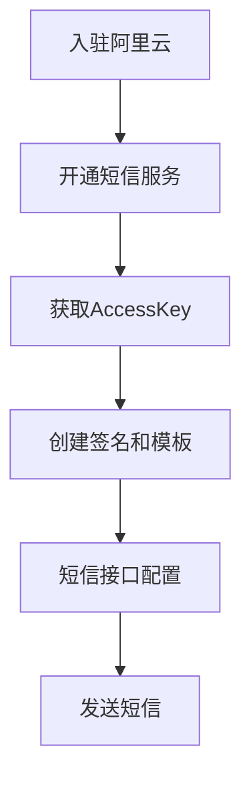

#### 前言
短信服务是阿里云为用户提供的一种通信服务的能力，支持向国内和国际快速发送验证码、短信通知和推广短信，服务范围覆盖全球200多个国家和地区。

#### 产品功能
- 短信通知：99%到达率，电信级运维保障，实时监控自动切换。大容量高并发，支撑双11期间2亿用户发送6亿短信。
- 推广短信：支持多种推广内容的短信发放，例如业务推广、新产品宣讲、会员关怀等内容的短信，为提升企业产品增加曝光率提供帮助。
- 异步通知：支持多种推广内容的短信发放，例如业务推广、新产品宣讲、会员关怀等内容的短信，为提升企业产品增加曝光率提供帮助。
- 数据统计：可查看请求量、发送成功量、失败量、等统计数据；通过日期、手机号等维度，查看发送详情。
- 短信验证码：3秒可达，三网合一专属通道，与工信部携号转网平台实时互联。变量灵活，支持带入变量，内容灵活，可适应支持各业务场景。

#### 使用流程

#### 实现步骤
- 添加阿里云SDK依赖
```Java
#引入依赖
<dependency>
   <groupId>com.aliyun</groupId>
   <artifactId>aliyun-java-sdk-core</artifactId>
   <version>4.0.2</version>
</dependency>
<dependency>
   <groupId>com.aliyun</groupId>
   <artifactId>aliyun-java-sdk-dysmsapi</artifactId>
   <version>1.1.0</version>
</dependency>
```
- 短信发送工具类
```Java
/**
 * 
 * 短信API产品的DEMO程序,工程中包含了一个SmsDemo类，直接通过执行main函数即可体验短信产品API功能(只需要将AK替换成开通了云通信-短信产品功能的AK即可)
 * 
 * 1:aliyun-java-sdk-core.jar
 * 2:aliyun-java-sdk-dysmsapi.jar
 * 工程依赖了2个jar包(存放在工程的libs目录下)
 *
 * 备注:Demo工程编码采用UTF-8
 */
public class SmsDemoUtils {

    //产品名称:云通信短信API产品,开发者无需替换
    static final String product = "Dysmsapi";
    //产品域名,开发者无需替换
    static final String domain = "dysmsapi.aliyuncs.com";

    // TODO 此处需要替换成开发者自己的AK(在阿里云访问控制台寻找)
    private static  String accessKeyId;

    private static  String accessKeySecret;

    public SmsDemoUtils(String accessKeyId,String accessKeySecret){
        this.accessKeyId = accessKeyId;
        this.accessKeySecret = accessKeySecret;
    }

    public static SendSmsResponse sendSms(String verifyCode, String mobile, String templateCode,String signName) throws ClientException {
        //可自助调整超时时间
        System.setProperty("sun.net.client.defaultConnectTimeout", "10000");
        System.setProperty("sun.net.client.defaultReadTimeout", "10000");

        //初始化acsClient,暂不支持region化
        IClientProfile profile = DefaultProfile.getProfile("cn-hangzhou", accessKeyId, accessKeySecret);
        DefaultProfile.addEndpoint("cn-hangzhou", "cn-hangzhou", product, domain);
        IAcsClient acsClient = new DefaultAcsClient(profile);

        //组装请求对象-具体描述见控制台-文档部分内容
        SendSmsRequest request = new SendSmsRequest();
        //必填:待发送手机号
        request.setPhoneNumbers(mobile);
        //必填:短信签名-可在短信控制台中找到
        request.setSignName(signName);
        //必填:短信模板-可在短信控制台中找到
        request.setTemplateCode(templateCode);//"SMS_142065350"
        //可选:模板中的变量替换JSON串,如模板内容为"亲爱的${name},您的验证码为${code}"时,此处的值为
       //"[{\"name\":\"Tom\", \"code\":\"123\"},{\"name\":\"Jack\", \"code\":\"456\"}]"
      //[{\"name\":"+ param.get("name") +", \"code\":"+ param.get("verifyCode") +", \"time\":"+ param.get("data") +"}]

        String templateParam = "{\"code\":\""+ verifyCode +"\"}";
        System.out.println(templateParam);
        request.setTemplateParam(templateParam);

        //选填-上行短信扩展码(无特殊需求用户请忽略此字段)
        //request.setSmsUpExtendCode("90997");

        //可选:outId为提供给业务方扩展字段,最终在短信回执消息中将此值带回给调用者
        request.setOutId("yourOutId");

        //hint 此处可能会抛出异常，注意catch
        SendSmsResponse sendSmsResponse = acsClient.getAcsResponse(request);

        return sendSmsResponse;
    }

    public static String getMessage(String code){
        switch (code){
            case "isp.RAM_PERMISSION_DENY" :
                return "RAM权限DENY";
            case "isv.OUT_OF_SERVICE    " :
                return "业务停机";
            case "isv.PRODUCT_UN_SUBSCRIPT" :
                return "未开通云通信产品的阿里云客户";
            case "isv.PRODUCT_UNSUBSCRIBE" :
                return "产品未开通";
            case "isv.ACCOUNT_NOT_EXISTS" :
                return "账户不存在";
            case "isv.ACCOUNT_ABNORMAL" :
                return "账户异常";
            case "isv.SMS_TEMPLATE_ILLEGAL" :
                return "短信模板不合法";
            case "isv.SMS_SIGNATURE_ILLEGAL" :
                return "短信签名不合法";
            case "isv.INVALID_PARAMETERS" :
                return "参数异常";
            case "isp.SYSTEM_ERROR" :
                return "系统错误";
            case "isv.MOBILE_NUMBER_ILLEGAL" :
                return "非法手机号";
            case "isv.MOBILE_COUNT_OVER_LIMIT" :
                return "手机号码数量超过限制";
            case "isv.TEMPLATE_MISSING_PARAMETERS" :
                return "模板缺少变量";
            case "isv.BUSINESS_LIMIT_CONTROL" :
                return "业务限流";
            case "isv.INVALID_JSON_PARAM" :
                return "JSON参数不合法，只接受字符串值";
            case "isv.BLACK_KEY_CONTROL_LIMIT" :
                return "黑名单管控";
            case "isv.PARAM_LENGTH_LIMIT" :
                return "参数超出长度限制";
            case "isv.PARAM_NOT_SUPPORT_URL" :
                return "不支持URL";
            case "isv.AMOUNT_NOT_ENOUGH" :
                return "账户余额不足";
            default:
                return "";
        }
    }

    public static QuerySendDetailsResponse querySendDetails(String bizId) throws ClientException {

        //可自助调整超时时间
        System.setProperty("sun.net.client.defaultConnectTimeout", "10000");
        System.setProperty("sun.net.client.defaultReadTimeout", "10000");

        //初始化acsClient,暂不支持region化
        IClientProfile profile = DefaultProfile.getProfile("cn-hangzhou", accessKeyId, accessKeySecret);
        DefaultProfile.addEndpoint("cn-hangzhou", "cn-hangzhou", product, domain);
        IAcsClient acsClient = new DefaultAcsClient(profile);

        //组装请求对象
        QuerySendDetailsRequest request = new QuerySendDetailsRequest();
        //必填-号码(邓部长手机号码)
        request.setPhoneNumber("17786575451");
        //可选-流水号
        request.setBizId(bizId);
        //必填-发送日期 支持30天内记录查询，格式yyyyMMdd
        SimpleDateFormat ft = new SimpleDateFormat("yyyyMMdd");
        request.setSendDate(ft.format(new Date()));
        //必填-页大小
        request.setPageSize(10L);
        //必填-当前页码从1开始计数
        request.setCurrentPage(1L);

        //hint 此处可能会抛出异常，注意catch
        QuerySendDetailsResponse querySendDetailsResponse = acsClient.getAcsResponse(request);

        return querySendDetailsResponse;
    }

    //生成随机6位短信验证码数字
    public static String getRandNum() {
        String code = "";
        Random random = new Random();
        for (int i = 0; i < 6; i++) {
            int r = random.nextInt(10); //每次随机出一个数字（0-9）
            code = code + r;  //把每次随机出的数字拼在一起
        }
        return code;
    }

    public static void main(String[] args) throws ClientException, InterruptedException {

        String mobile = "";//手机号
        String verifyCode = "";//短信验证码
        String templateCode = "";//短信模板Code

        SendSmsResponse response = null;
        try {
            SmsDemoUtils smsDemoUtils = new SmsDemoUtils("keyId","secret");
            response = sendSms(verifyCode, mobile, templateCode,"短信签名");
        } catch (ClientException e) {
            e.printStackTrace();
        }

        System.out.println("短信接口返回的数据----------------");
        System.out.println("Code=" + response.getCode());
        System.out.println("Message=" + response.getMessage());
        System.out.println("RequestId=" + response.getRequestId());
        System.out.println("BizId=" + response.getBizId());

        Thread.sleep(3000L);
        //查明细
        if(response.getCode() != null && response.getCode().equals("OK")) {
            QuerySendDetailsResponse querySendDetailsResponse = querySendDetails(response.getBizId());
            System.out.println("短信明细查询接口返回数据----------------");
            System.out.println("Code=" + querySendDetailsResponse.getCode());
            System.out.println("Message=" + querySendDetailsResponse.getMessage());
            int i = 0;
            for(QuerySendDetailsResponse.SmsSendDetailDTO smsSendDetailDTO : querySendDetailsResponse.getSmsSendDetailDTOs())
            {
                System.out.println("SmsSendDetailDTO["+i+"]:");
                System.out.println("Content=" + smsSendDetailDTO.getContent());
                System.out.println("ErrCode=" + smsSendDetailDTO.getErrCode());
                System.out.println("OutId=" + smsSendDetailDTO.getOutId());
                System.out.println("PhoneNum=" + smsSendDetailDTO.getPhoneNum());
                System.out.println("ReceiveDate=" + smsSendDetailDTO.getReceiveDate());
                System.out.println("SendDate=" + smsSendDetailDTO.getSendDate());
                System.out.println("SendStatus=" + smsSendDetailDTO.getSendStatus());
                System.out.println("Template=" + smsSendDetailDTO.getTemplateCode());
            }
            System.out.println("TotalCount=" + querySendDetailsResponse.getTotalCount());
            System.out.println("RequestId=" + querySendDetailsResponse.getRequestId());
        }
    }
}
```