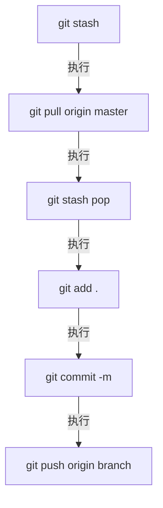
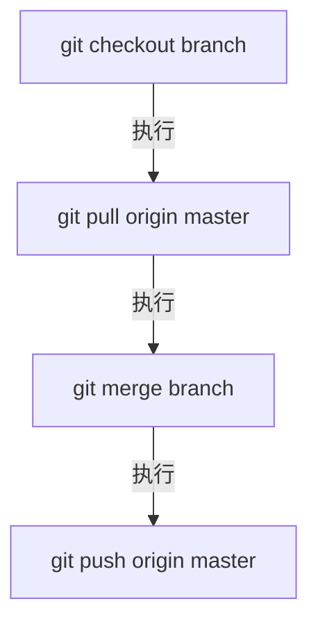

#### 前言
&emsp;&emsp;Git是一个开源的分布式版本控制系统，用于敏捷高效地处理任何或小或大的项目。Git与常用的版本控制工具CVS，Subversion等不同，它采用了分布式版本库的方式，因此它不必服务端软件的支持。

- Git与SVN的区别
1. Git是分布式的，而SVN不是。
2. Git把内容按元数据方式进行存储，而SVN则是按文件：所有的资源控制系统都是把文件的元信息隐藏在一个类似.svn、.cvs等的文件夹里。
3. Git分支和SVN的分支不同：分支在SVN中一点都不特别，其实它就是版本库中的另外一个目录。
4. Git没有一个全局的版本号，而SVN有。
5. Git 的内容完整性要优于 SVN：Git 的内容存储使用的是 SHA-1 哈希算法。这能确保代码内容的完整性，确保在遇到磁盘故障和网络问题时降低对版本库的破坏。

- Git的三种状态
1. staged：  已暂存-表示对一个已经修改的文件的当前版本做了标记，使之包含在下次提交的快照中。
2. modified：已修改-表示数据已修改但还未保存。
3. commited：已提交-表示数据已经安全的保存在本地的数据库中。

- 常用命令
- 创建
```
$ git init 创建一个新的本地仓库
$ git clone url 复制一个已创建的仓库
```
- 本地修改
```
$ git status 显示工作路径下全部已修改的文件
```
```
$ git diff 显示与上次提交版本文件的不同
```
```
$ git add . 把当前所有修改添加到下次提交中
$ git add -p 指定某个文件的修改添加到下次提交中
```
```
$ git commit 提交之前已标记的变化
$ git commit -a 提交本地的所有修改
$ git commit --amend 修改上次提交（请勿修改已发布的提交记录）
```
- 提交历史
```
$ git log 从最新的提交开始显示所有的提交记录
$ git log -p <file> 显示指定文件的所有修改
```
- 分支与标签
```
$ git branch -a 显示所有分支
$ git branch -d <branch> 删除本地分支
```
```
$ git checkout <branch> 切换当前分支
$ git checkout -b <branch> 创建并切换分支
```
```
$ git tag <tagName> 给当前的提交打标签
```
- 更新与发布
```
$ git remote show <remote> 显示远程端信息
$ git remote add <shortname> <url> 添加新的远程端
```
```
$ git pull <remote/branch> 下载远程端的所有改动到本地，自动合并到当前分支
$ git fetch <remote/branch> 下载远程端的所有改动到本地，不会自动合并到当前分支
```
```
$ git push --tags 发布标签
$ git push <remote/branch> 将本地版本发布到远程端
```
```
$ git branch -dr <remote/branch> 删除远程端分支
```
- 合并与重置
```
$ git merge <branch> 将分支合并到当前分支
```
```
$ git rebase <branch> 将当前版本重置到分支中（请勿重置已提交的发布）
$ git rebase --abort 退出重置
$ git rebase --continue 解决冲突后继续重置
```
- 撤销
```
$ git reset --hard 放弃工作目录下的所有修改
$ git revert <commit> 重置一个提交（通过创建一个截然不同的新提交）
```
##### 提交顺序

##### 合并顺序
