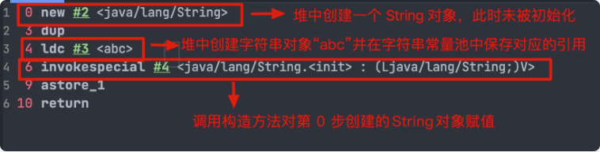

## 面向对象

### 面向对象和面向过程的区别
两者的主要区别在于解决问题的方式不同：
- 面向过程把解决问题的过程拆成一个个方法，通过一个个方法的执行解决问题。
- 面向对象会先抽象出对象，然后用对象执行方法的方式来解决问题。另外，面向对象开发的程序一般更易维护、易复用、易扩展。


### 创建一个对象用什么运算符？对象实体与对象引用有何不同？
1. 创建一个对象使用 new 运算符，new 创建对象实例（对象实例存放在堆中），对象引用指向对象实例（对象引用存在在栈内存中）。
2. 一个对象引用可以指向 0 个或 1 个对象（一根绳子可以不系气球，也可以只系一个气球）；一个对象实体可以有 n 个对象引用指向它（可以用 n 条绳子系住一个气球）


### 对象相等和引用相等的区别？
1. 对象相等一般比较的是内存中存放的内容是否相等。
2. 引用相等一般比较的是他们所指向的内存地址是否相等。


### 类的构造方法的作用是什么？
构造方法是一种特殊的方法，主要作用是完成对象的初始化工作。


### 如果一个类没有声明构造方法，该程序能够正确执行吗？
如果一个类没有声明构造方法，该程序也能够正确执行。因为一个类即使没有声明构造方法也会有默认的不带参数的构造方法。如果我们自己添加了类的构造方法（无论是否有参），Java就不会再添加默认的无参构造方法了，我们一直在不知不觉地使用构造方法，这也是为什么在创建对象的时候后面要加一个括号（因为要调用无参的构造方法）。如果我们重载了有参的构造方法，记得都要把无参的构造方法都写出来（无论是否用到），因为这可以帮助我们在创建对象的时候少踩坑。


### 构造方法有哪些特点？是否可被重写？
构造方法特点如下：
- 名字与类名相同。
- 生成类的对象时自动执行，无需调用。
- 没有返回值，但不能用 void 关键字声明构造函数。

构造方法不能被 override（重写），但是可以 overload（重载），所以我们可以看到一个类中有多个构造函数的情况。

****

## 面向对象三大特征

### 封装
封装是指将一个对象的状态信息（也就是属性）隐藏在对象内部，不允许外部对象直接访问对象的内部信息。但是可以提供一些被外界访问的方法来操作属性。就好像我们看不到挂在墙上的空调的内部零件信息（也就是属性），但是我们可以通过遥控器（也就是方法）来控制空调。如果属性不想被外界访问，我们大可不必提供方法给外界访问。但是如果一个类没有提供给外界访问的方法，那么这个类也没有什么意义了。这就好比如果没有空调遥控器，那么我们就无法操控空调来进行制冷，空调本身也就没有意义了。
```java
public class Student {

    // id属性私有化
    private int id;
    // name属性私有化
    private String name;

    // 获取id的方法
    public int getId() {
        return id;
    }

    // 设置id的方法
    public void setId(int id) {
        this.id = id;
    }

    // 获取name的方法
    public String getName() {
        return name;
    }

    // 设置name的方法
    public void setName(String name) {
        this.name = name;
    }
}
```


### 继承
不同类型的对象，相互之间经常有一定数量的共同点。例如，小明同学、小红同学、小李同学，都共享学生的特性（班级、学号等）。同时，每一个对象还定义了额外的特性使得他们与众不同。（例如小明的数学比较好，小红的性格惹人喜欢，小李的力气比较大）。继承是使用已存在的类的定义作为基础建立新类的技术，新类的定义可以增加新的数据或新的功能，也可以用父类的功能，但不能选择性地继承父类。通过使用继承，可以快速地创建新的类，可以提高代码的重用，以及程序的可维护性，从而节省大量创建新类的时间，提高我们的开发效率。

⚠️关于继承如下3点请记住：
1. 子类可以用自己的方式实现父类的方法。
2. 子类可以拥有自己的属性和方法，即子类可以对父类进行扩展。
3. 子类拥有父类对象所有的属性和方法（包括私有属性和私有方法），但是父类中的私有属性和方法子类是无法访问的，仅仅只是拥有。


### 多态
多态，顾名思义，表示一个对象具有多种的状态，具体表现为父类的引用指向子类的实例。

多态的特点：
- 多态不能调用“只在子类存在但在父类不存在的方法”；
- 对象类型和引用类型之间具有继承（类）/实现（接口）的关系；
- 引用类型变量所发出的方法调用的到底是哪个类中的方法，必须在程序运行期间才能确定；
- 如果子类重写了父类的方法，真正执行的是子类覆盖的方法，如果子类没有覆盖父类的方法，执行的则是父类的方法。


### 接口和抽象类有什么共同点和区别？
相同点：
- 都不能被实例化。
- 都可以包含抽象方法。
- 都可以有默认实现的方法（Java8 可以用 default 关键字在接口中定义方法）。

不同点：
- 一个类只能继承一个类，但是可以实现多个接口。
- 接口主要用于对类的行为进行约束，你实现了某个接口就具有了对应的行为。而抽象类主要用于代码复用，强调的是所属关系。
- 接口中的成员变量只能是 public static final 类型的，不能被修改且必须有初始值，但是抽象类的成员变量默认为 default，可在子类中被重新定义，也可以被重新赋值。


### 深拷贝与浅拷贝的的区别了解吗？什么是引用拷贝？
- 深拷贝：深拷贝会完全复制整个对象，包括这个对象所包含的内部对象。
- 浅拷贝：浅拷贝会在堆上创建一个新的对象（也是区别于引用拷贝的一点），不过，如果原对象内部的属性是引用类型的话，浅拷贝会直接复制内部对象的引用地址，也就是说拷贝对象会和原对象共用同一个内部对象。


浅拷贝的示例代码如下：  
我们这里实现了 Cloneable 接口，并重写了 clone() 方法，而 clone() 方法的实现很简单，直接调用的是父类 object() 的 clone() 方法。
```java
public class Address implements Cloneable{

    private String name;
    // 省略构造函数、Getter&Setter方法

    // 重写了 clone() 方法
    @Override
    public Address clone() {
        try {
            return (Address) super.clone();
        } catch (CloneNotSupportedException e) {
            throw new AssertionError();
        }
    }
}

public class Person implements Cloneable {

    private Address address;
    // 省略构造函数、Getter&Setter方法

    重写了 clone() 方法
    @Override
    public Person clone() {
        try {
            Person person = (Person) super.clone();
            return person;
        } catch (CloneNotSupportedException e) {
            throw new AssertionError();
        }
    }
}
```
测试结果：
```java
Person person1 = new Person(new Address("武汉"));

Person person1Copy = person1.clone();
System.out.println(person1.getAddress() == person1Copy.getAddress());// true
```
从测试结果就可以看出，person1 和 person1 的克隆对象使用的仍然是同一个 Address 对象。


深拷贝的示例代码如下：  
这里我们需要简单对 Person 类的 clone() 方法进行修改，因为需要连带着把 Person 对象内部的 Address 对象一起复制。
```java
public class Address implements Cloneable{

    private String name;
    // 省略构造函数、Getter&Setter方法

    // 重写了 clone() 方法
    @Override
    public Address clone() {
        try {
            return (Address) super.clone();
        } catch (CloneNotSupportedException e) {
            throw new AssertionError();
        }
    }
}

public class Person implements Cloneable {

    private Address address;
    // 省略构造函数、Getter&Setter方法

    重写了 clone() 方法
    @Override
    public Person clone() {
        try {
            Person person = (Person) super.clone();
            person.setAddress(person.getAddress().clone());
            return person;
        } catch (CloneNotSupportedException e) {
            throw new AssertionError();
        }
    }
}
```
测试结果：
```java
Person person1 = new Person(new Address("武汉"));

Person person1Copy = person1.clone();
System.out.println(person1.getAddress() == person1Copy.getAddress());// false
```
从测试结果就可以看出，显然 person1 和 person1 的克隆对象所包含的 Address 对象已经是不同的了。


#### 那什么是引用拷贝呢？
简单来说，引用拷贝就是两个不同的引用指向同一个对象。

  

****
## Java常见类

### Object
### Object类的常见方法有哪些？
Object类是一个特殊的类，是所有类的父类。它主要提供了以下的 11 个方法：
```java

/**
 * native 方法，用于返回对象的哈希码，主要使用在哈希表中，比如 JDK 中的HashMap。
 */
public native int hashCode()
/**
 * native 方法，用于返回当前运行时对象的 Class 对象，使用了 final 关键字修饰，故不允许子类重写。
 */
public final native Class<?> getClass()
/**
 * naitive 方法，用于创建并返回当前对象的一份拷贝。
 */
protected native Object clone() throws CloneNotSupportedException


/**
 * 返回类的名字实例的哈希码的 16 进制的字符串。建议 Object 所有的子类都重写这个方法。
 */
public String toString()
/**
 * 用于比较 2 个对象的内存地址是否相等，String 类对该方法进行了重写以用于比较字符串的值是否相等。
 */
public boolean equals(Object obj)


/**
 * 唤醒一个在此对象监视器上等待的线程(监视器相当于就是锁的概念)。如果有多个线程在等待只会任意唤醒一个。
 */
public final native void notify()
/**
 * native 方法，并且不能重写。跟 notify 一样，唯一的区别就是会唤醒在此对象监视器上等待的所有线程，而不是一个线程。
 */
public final native void notifyAll()


/**
 * 跟之前的2个wait方法一样，只不过该方法一直等待，没有超时时间这个概念
 */
public final void wait() throws InterruptedException
/**
 * 暂停线程的执行。注意：sleep 方法没有释放锁，而 wait 方法释放了锁 ，timeout 是等待时间。
 */
public final native void wait(long timeout) throws InterruptedException
/**
 * 多了 nanos 参数，这个参数表示额外时间（以毫微秒为单位，范围是 0-999999）。 所以超时的时间还需要加上 nanos 毫秒。。
 */
public final void wait(long timeout, int nanos) throws InterruptedException


/**
 * 实例被垃圾回收器回收的时候触发的操作
 */
protected void finalize() throws Throwable { }
```


### ==和equals()的区别？
== 对于基本数据类型和引用数据类型的作用效果是不同的：
- 对于基本数据类型来说，== 比较的是值。
- 对于引用数据类型来说，== 比较的是对象的内存地址。
```
因为在Java中只有值传递，所以，对于 == 来说，不管是比较基本数据类型，还是比较引用数据类型的变量，其本质比较的都是值，只是引用类型变量存的值是对象在内存中的地址。
```
equals() 不能用于判断基本数据类型的变量，只能用来判断两个对象是否相等。  
equals() 方法存在于Object类中，而Object类是所有类的直接或间接的父类，因此所有的类都有equals()方法。  

Object类中的equals()方法：
```java
public boolean equals(Object obj) {
     return (this == obj);
}
```
equals()方法存在以下两种使用情况：
- 类没有重写equals()方法：通过equals()方法比较该类的两个对象时，等价于通过“==”比较这两个对象，此时默认使用的是Object类中的equals()方法。
- 类已重写了equals()方法：一般我们都重写equals()方法来比较两个对象中的属性值是否相等；若它们的属性值相等，则返回为true，即认为这两个对象相等。

```java
// 此处仅为了举例，实际若按照下面的这种写法，IDEA工具会提示你将 == 换成 equals()

// 放在常量池中
String aa = "ab";
// 从常量池中查找
String bb = "ab";
// a 为一个引用
String a = new String("ab"); 
// b为另一个引用,对象的内容一样
String b = new String("ab"); 

// false
System.out.println(a == b);  
// true   
System.out.println(aa == bb);
// true
System.out.println(42 == 42.0);
// true
System.out.println(a.equals(b));
```
String中的equals()方法是被重写过的，因为Object中的equals()方法是比较的对象的内存地址，而String中的equals()方法比较的是对象的值。  
当创建String类型的对象时，虚拟机会在常量池中查找有没有已经存在的值和要创建的值相同的对象，如果有就把它赋值给当前引用，如果没有就在常量池中重新创建一个String对象。

String类中的equals()方法：
```java
public boolean equals(Object anObject) {
    if (this == anObject) {
        return true;
    }
    if (anObject instanceof String) {
        String anotherString = (String)anObject;
        int n = value.length;
        if (n == anotherString.value.length) {
            char v1[] = value;
            char v2[] = anotherString.value;
            int i = 0;
            while (n-- != 0) {
                if (v1[i] != v2[i])
                    return false;
                i++;
            }
            return true;
        }
    }
    return false;
}
```


### hashCode()有什么用？  
hashCode()的作用是获取哈希码（int整数），也称为散列码。这个哈希码的作用是确定该对象在哈希表中的索引位置。  
hashCode()定义在JDK中的 Object() 类中，这就意味着 Java 中的任何类都包含有 hashCode() 函数。另外需要注意的是：Object 的 hashCode() 方法是本地的方法，也就是用 C 语言或者 C++ 实现的。
```java 
public native int hashCode();
```
散列表存储的是键值对(key-value)，它的特点是：能够根据"键"快速的检索出对应的"值"。这其中就利用到了散列码，进而可以快速找到所需要的对象。


### 为什么要有hashCode？  
下面以"hashCode"是如何检查重复为例子来说明为什么要有 hashCode？  
下面这段内容摘自我的 Java 启蒙书 《Head First Java》：  
```
当你把对象加入 HashSet 时，HashSet 会先计算对象的 HashCode 值来判断对象加入的位置，同时也会与其他已经加入的对象的 HashCode 值作比较，如果没有相符的 HashCode，HashSet会假设对象没有重复出现。但是如果发现有相同的 HashCode 值得对象，这时就会调用 equals() 方法来检查 HashCode 相等的对象是否真的相同。如果两者相同，HashSet 就不会让其加入操作成功。如果不同的话，就会重新散列到其他的位置，这样就会大大减少 equals 的次数，相应就大大提高了执行的速度。
```
其实，hashCode()和equals()方法都是用于比较两个对象是否相等，那为什么 JDK 中却还要同时提供这两个方法呢？  
这是因为在一些容器中（比如 HashMap、HashSet）中，有了 hashCode() 之后，判断元素是否在对应容器中效率会更高  
我们在前面也提到了添加元素进 HashSet 的过程，如果 HashSet 在对比的时候，同样的 hashCode 有多个对象时，它会继续用 equals() 方法来判断是否真的相同。也就是说 hashCode 帮助我们大大缩小了查找成本。

那为什么不只提供 hashCode() 方法呢？  
这是因为两个对象的 hashCode 值相等并不代表这两个对象就相等。  

那为什么两个对象有相同的 hashCode 值，它们也不一定是相等的呢？  
因为 hashCode() 所使用的哈希算法也许刚好会让多个对象传回相同的哈希值。越糟糕的哈希算法越容易碰撞，但这也与数据值域分布的的特性相关（所谓哈希碰撞也就是指的是不同的对象得到相同的 hashCode）  

综上所述，总结下来就是：
- 如果两个对象的 hashCode 值相等，那这两个对象不一定相等（哈希碰撞）
- 如果两个对象的 hashCode 值相等并且 equals() 方法也返回 true，我们才认为这两个对象相等。
- 如果两个对象的 hashCode 值不相等，那我们就可以直接认为这两个对象不相等。


### 为什么重写equals()时必须重写hashCode()方法？  
因为两个相等的对象的 hashCode 值必须是相等，也就是说如果 equals 方法判断两个是相等的，那这两个对象的 hashCode 值也要相等。  
如果重写 equals() 方法 时没有重写 hashCode() 方法的话就可能会导致 equals 方法判断是相等的两个对象，但 hashCode 值却又不相等。

总结：
- 两个对象有相同的 hashCode 值，他们也不一定是相等的（哈希碰撞）。
- equals() 方法判断两个对象是相等的，那这两个对象的 hashCode 值也要相等。  


### String
### String、StringBuffer、StringBuilder的区别？
- String 是不可变的。  
- StringBuilder 与 StringBuffer 都继承自 AbstractStringBuilder 类，在 AbstractStringBuilder 中也是使用字符数组保存字符串，不过没有使用 final 和 private 关键字修饰。

线程安全性  
String 中的对象是不可变的，也就可以理解为常量，线程安全。  
StringBuffer 对方法加了同步锁或者对调用的方法加了同步锁，所以是线程安全的，StringBuilder 并没有针对方法增加同步锁，所以是线程安全。  
AbstractStringBuilder 是 StringBuilder 与 StringBuffer 的公共父类，定义了一些字符串的基本操作，如 expandCapacity、append、insert、indexOf 等公共方法。

性能  
Java 中每次对 String 类型进行改变的时候，都会生成一个新的 String 对象，然后将指针指向新的 String 对象。  
StringBuffer 每次都会对 StringBuffer 对象本身进行操作，而不是生成新的对象并改变对象引用，相同情况下使用 StringBuilder 相比使用 StringBuffer 仅能获得10%-15%左右的性能提示，但却要冒线程不安全的风险。  

对于三者使用的总结如下：  
- 操作少量的数据：适用于 String
- 单线程操作字符串缓冲区下操作大量数据：使用于 StringBuilder
- 多线程操作字符串缓冲区下操作大量数据：使用于 StringBuffer


### String为什么是不可变的？
String 类中使用 final 关键字修饰字符数组来保存字符串。
```java 
public final class String implements java.io.Serializable, Comparable<String>, CharSequence {
    private final char value[];
	//...
}
```
我们知道被 fianal 关键字修饰的类不能被继承，修饰的方法不能被重写，修饰的变量是基本数据类型则值不能改变，修饰的变量是引用类型则不能再指向其他对象。  
因此，final 关键字修饰的数组来保存字符串并不是 String 不可变的根本原因，因为这个数组保存的字符串是可变的，String 真正不可变的原因为下面的几点原因所致：  
- String 类被 final 修饰导致其不能被继承，进而避免了子类破坏 String 不可变。
- 保存字符串的数组被 final 修饰且为私有的，并且 String 类没有提供/暴露修改这个字符串的方法。


### 字符串拼接用"+"还是使用StringBuilder？
Java 语言本身并不支持运算符重载，"+" 和 "+=" 是专门为 String 类重载过的运算，也是 Java 中仅有的两个重载过的运算符。  
字符串对象通过"+"的字符串拼接方式，实际上是通过 StringBuilder 调用 append() 方法实现的，拼接完成之后调用 toString() 来得到一个String 对象。  
不过，在循环内使用"+"进行字符串的拼接的话，存在较为明显的缺陷：编译器不会创建单个 StringBuilder 以复用，会导致创建过多的 StringBuilder 对象。  
```java
String[] arr = {"he", "llo", "world"};
String s = "";
for (int i = 0; i < arr.length; i++) {
    s += arr[i];
}
System.out.println(s);
```
StringBuilder 对象是在循环内部被创建的，这意味着每循环一次就会创建一个 StringBuilder 对象。  
```java
String[] arr = {"he", "llo", "world"};
StringBuilder s = new StringBuilder();
for (String value : arr) {
    s.append(value);
}
System.out.println(s);
```
但如果直接使用 StringBuilder 对象进行字符串拼接的话，就不会存在这个问题了，因为StringBuilder 对象是在循环外部被创建的。  
不过，使用"+"进行字符串拼接会产生大量的临时对象的问题已在 JDK9 中得到了解决。在 JDK9[JEP 280](https://openjdk.org/jeps/280) 当中，字符串相加 "+" 改为了用动态的方法 makeConcatWithConstants() 来实现，而非使用大量的 StringBuilder 对象了。


### String类中的equal()和Object类中的equal()方法有何区别？
String 中的 equals方法是被重写过的，比较的是 String 字符串的值是否相等。Object 中的 equals方法则是比较的对象的内存地址是否相等。


### 字符串常量池的作用？
字符串常量池是 JVM 为了提升性能和减少内存消耗而针对字符串（String类）专门开辟的一块区域，主要目的是为了避免字符串的重复创建。
```java
// 在堆中创建字符串对象”ab“
// 将字符串对象”ab“的引用保存在字符串常量池中
String aa = "ab";
// 直接返回字符串常量池中字符串对象”ab“的引用
String bb = "ab";
System.out.println(aa==bb);        // true
```


### String s1 = new String("abc");这行代码创建了几个字符串对象？
- 如果字符串常量池中已存在字符串对象"abc"的引用，则只会在堆中创建1个字符串对象"abc"。
```
// 字符串常量池中已存在字符串对象“abc”的引用
String s1 = "abc";
// 下面这段代码只会在堆中创建 1 个字符串对象“abc”
String s2 = new String("abc");
```
- 如果字符串常量池中不存在字符串对象"abc"的引用，那么它会在堆上创建两个字符串对象，且其中一个字符串对象的引用会被保存在字符串常量池中。
```
String s1 = new String("abc");
```
  
ldc 命令用于判断字符串常量池中是否保存了对应的字符串对象的引用，如果保存了的话就直接返回，如果没有保存的话，则会在堆中创建对应的字符串对象并将该字符串对象的引用保存至字符串常量池中。


### String.intern方法有什么作用？
String.intern() 是一个 native（本地）方法，其作用是将指定的字符串对象的引用保存在字符串常量池中，可以简单分为以下两种情况：
- 如果字符串常量池中保存了对应的字符串对象的引用，就直接返回该引用。
- 如果字符串常量池中没有保存对应的字符串对象的引用，那就在常量池中创建一个指向该字符串对象的引用并返回。

示例代码（JDK1.8）:
```java
// 在堆中创建字符串对象”Java“
// 将字符串对象”Java“的引用保存在字符串常量池中
String s1 = "Java";
// 直接返回字符串常量池中字符串对象”Java“对应的引用
String s2 = s1.intern();
// 会在堆中在单独创建一个字符串对象
String s3 = new String("Java");
// 直接返回字符串常量池中字符串对象”Java“对应的引用
String s4 = s3.intern();
// s1 和 s2 指向的是堆中的同一个对象
System.out.println(s1 == s2); // true
// s3 和 s4 指向的是堆中不同的对象
System.out.println(s3 == s4); // false
// s1 和 s4 指向的是堆中的同一个对象
System.out.println(s1 == s4); // true
```


