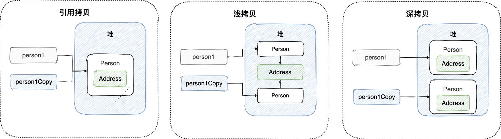

## 面向对象

### 面向对象和面向过程的区别
两者的主要区别在于解决问题的方式不同：
- 面向过程把解决问题的过程拆成一个个方法，通过一个个方法的执行解决问题。
- 面向对象会先抽象出对象，然后用对象执行方法的方式来解决问题。另外，面向对象开发的程序一般更易维护、易复用、易扩展。


### 创建一个对象用什么运算符？对象实体与对象引用有何不同？
1. 创建一个对象使用 new 运算符，new 创建对象实例（对象实例存放在堆中），对象引用指向对象实例（对象引用存在在栈内存中）。
2. 一个对象引用可以指向 0 个或 1 个对象（一根绳子可以不系气球，也可以只系一个气球）；一个对象实体可以有 n 个对象引用指向它（可以用 n 条绳子系住一个气球）


### 对象相等和引用相等的区别？
1. 对象相等一般比较的是内存中存放的内容是否相等。
2. 引用相等一般比较的是他们所指向的内存地址是否相等。


### 类的构造方法的作用是什么？
构造方法是一种特殊的方法，主要作用是完成对象的初始化工作。


### 如果一个类没有声明构造方法，该程序能够正确执行吗？
如果一个类没有声明构造方法，该程序也能够正确执行。因为一个类即使没有声明构造方法也会有默认的不带参数的构造方法。如果我们自己添加了类的构造方法（无论是否有参），Java就不会再添加默认的无参构造方法了，我们一直在不知不觉地使用构造方法，这也是为什么在创建对象的时候后面要加一个括号（因为要调用无参的构造方法）。如果我们重载了有参的构造方法，记得都要把无参的构造方法都写出来（无论是否用到），因为这可以帮助我们在创建对象的时候少踩坑。

·
### 构造方法有哪些特点？是否可被重写？
构造方法特点如下：
- 名字与类名相同。
- 生成类的对象时自动执行，无需调用。
- 没有返回值，但不能用 void 关键字声明构造函数。

构造方法不能被 override（重写），但是可以 overload（重载），所以我们可以看到一个类中有多个构造函数的情况。

****

## 面向对象三大特征

### 封装
封装是指将一个对象的状态信息（也就是属性）隐藏在对象内部，不允许外部对象直接访问对象的内部信息。但是可以提供一些被外界访问的方法来操作属性。就好像我们看不到挂在墙上的空调的内部零件信息（也就是属性），但是我们可以通过遥控器（也就是方法）来控制空调。如果属性不想被外界访问，我们大可不必提供方法给外界访问。但是如果一个类没有提供给外界访问的方法，那么这个类也没有什么意义了。这就好比如果没有空调遥控器，那么我们就无法操控空调来进行制冷，空调本身也就没有意义了。
```java
public class Student {

    // id属性私有化
    private int id;
    // name属性私有化
    private String name;

    // 获取id的方法
    public int getId() {
        return id;
    }

    // 设置id的方法
    public void setId(int id) {
        this.id = id;
    }

    // 获取name的方法
    public String getName() {
        return name;
    }

    // 设置name的方法
    public void setName(String name) {
        this.name = name;
    }
}
```


### 继承
不同类型的对象，相互之间经常有一定数量的共同点。例如，小明同学、小红同学、小李同学，都共享学生的特性（班级、学号等）。同时，每一个对象还定义了额外的特性使得他们与众不同。（例如小明的数学比较好，小红的性格惹人喜欢，小李的力气比较大）。继承是使用已存在的类的定义作为基础建立新类的技术，新类的定义可以增加新的数据或新的功能，也可以用父类的功能，但不能选择性地继承父类。通过使用继承，可以快速地创建新的类，可以提高代码的重用，以及程序的可维护性，从而节省大量创建新类的时间，提高我们的开发效率。

⚠️关于继承如下3点请记住：
1. 子类可以用自己的方式实现父类的方法。
2. 子类可以拥有自己的属性和方法，即子类可以对父类进行扩展。
3. 子类拥有父类对象所有的属性和方法（包括私有属性和私有方法），但是父类中的私有属性和方法子类是无法访问的，仅仅只是拥有。


### 多态
多态，顾名思义，表示一个对象具有多种的状态，具体表现为父类的引用指向子类的实例。

多态的特点：
- 多态不能调用“只在子类存在但在父类不存在的方法”；
- 对象类型和引用类型之间具有继承（类）/实现（接口）的关系；
- 引用类型变量所发出的方法调用的到底是哪个类中的方法，必须在程序运行期间才能确定；
- 如果子类重写了父类的方法，真正执行的是子类覆盖的方法，如果子类没有覆盖父类的方法，执行的则是父类的方法。


### 接口和抽象类有什么共同点和区别？
相同点：
- 都不能被实例化。
- 都可以包含抽象方法。
- 都可以有默认实现的方法（Java8 可以用 default 关键字在接口中定义方法）。

不同点：
- 一个类只能继承一个类，但是可以实现多个接口。
- 接口主要用于对类的行为进行约束，你实现了某个接口就具有了对应的行为。而抽象类主要用于代码复用，强调的是所属关系。
- 接口中的成员变量只能是 public static final 类型的，不能被修改且必须有初始值，但是抽象类的成员变量默认为 default，可在子类中被重新定义，也可以被重新赋值。


### 深拷贝与浅拷贝的的区别了解吗？什么是引用拷贝？
- 深拷贝：深拷贝会完全复制整个对象，包括这个对象所包含的内部对象。
- 浅拷贝：浅拷贝会在堆上创建一个新的对象（也是区别于引用拷贝的一点），不过，如果原对象内部的属性是引用类型的话，浅拷贝会直接复制内部对象的引用地址，也就是说拷贝对象会和原对象共用同一个内部对象。


浅拷贝的示例代码如下：  
我们这里实现了 Cloneable 接口，并重写了 clone() 方法，而 clone() 方法的实现很简单，直接调用的是父类 object() 的 clone() 方法。
```java
public class Address implements Cloneable{

    private String name;
    // 省略构造函数、Getter&Setter方法

    // 重写了 clone() 方法
    @Override
    public Address clone() {
        try {
            return (Address) super.clone();
        } catch (CloneNotSupportedException e) {
            throw new AssertionError();
        }
    }
}

public class Person implements Cloneable {

    private Address address;
    // 省略构造函数、Getter&Setter方法

    重写了 clone() 方法
    @Override
    public Person clone() {
        try {
            Person person = (Person) super.clone();
            return person;
        } catch (CloneNotSupportedException e) {
            throw new AssertionError();
        }
    }
}
```
测试结果：
```java
Person person1 = new Person(new Address("武汉"));

Person person1Copy = person1.clone();
System.out.println(person1.getAddress() == person1Copy.getAddress());// true
```
从测试结果就可以看出，person1 和 person1 的克隆对象使用的仍然是同一个 Address 对象。


深拷贝的示例代码如下：  
这里我们需要简单对 Person 类的 clone() 方法进行修改，因为需要连带着把 Person 对象内部的 Address 对象一起复制。
```java
public class Address implements Cloneable{

    private String name;
    // 省略构造函数、Getter&Setter方法

    // 重写了 clone() 方法
    @Override
    public Address clone() {
        try {
            return (Address) super.clone();
        } catch (CloneNotSupportedException e) {
            throw new AssertionError();
        }
    }
}

public class Person implements Cloneable {

    private Address address;
    // 省略构造函数、Getter&Setter方法

    重写了 clone() 方法
    @Override
    public Person clone() {
        try {
            Person person = (Person) super.clone();
            person.setAddress(person.getAddress().clone());
            return person;
        } catch (CloneNotSupportedException e) {
            throw new AssertionError();
        }
    }
}
```
测试结果：
```java
Person person1 = new Person(new Address("武汉"));

Person person1Copy = person1.clone();
System.out.println(person1.getAddress() == person1Copy.getAddress());// false
```
从测试结果就可以看出，显然 person1 和 person1 的克隆对象所包含的 Address 对象已经是不同的了。


#### 那什么是引用拷贝呢？
简单来说，引用拷贝就是两个不同的引用指向同一个对象。

  

****
## Java常见类

### Object
#### Object类的常见方法有哪些？
Object类是一个特殊的类，是所有类的父类。它主要提供了以下的 11 个方法：
```java

/**
 * native 方法，用于返回对象的哈希码，主要使用在哈希表中，比如 JDK 中的HashMap。
 */
public native int hashCode()
/**
 * native 方法，用于返回当前运行时对象的 Class 对象，使用了 final 关键字修饰，故不允许子类重写。
 */
public final native Class<?> getClass()
/**
 * naitive 方法，用于创建并返回当前对象的一份拷贝。
 */
protected native Object clone() throws CloneNotSupportedException


/**
 * 返回类的名字实例的哈希码的 16 进制的字符串。建议 Object 所有的子类都重写这个方法。
 */
public String toString()
/**
 * 用于比较 2 个对象的内存地址是否相等，String 类对该方法进行了重写以用于比较字符串的值是否相等。
 */
public boolean equals(Object obj)


/**
 * 唤醒一个在此对象监视器上等待的线程(监视器相当于就是锁的概念)。如果有多个线程在等待只会任意唤醒一个。
 */
public final native void notify()
/**
 * native 方法，并且不能重写。跟 notify 一样，唯一的区别就是会唤醒在此对象监视器上等待的所有线程，而不是一个线程。
 */
public final native void notifyAll()


/**
 * 跟之前的2个wait方法一样，只不过该方法一直等待，没有超时时间这个概念
 */
public final void wait() throws InterruptedException
/**
 * 暂停线程的执行。注意：sleep 方法没有释放锁，而 wait 方法释放了锁 ，timeout 是等待时间。
 */
public final native void wait(long timeout) throws InterruptedException
/**
 * 多了 nanos 参数，这个参数表示额外时间（以毫微秒为单位，范围是 0-999999）。 所以超时的时间还需要加上 nanos 毫秒。。
 */
public final void wait(long timeout, int nanos) throws InterruptedException


/**
 * 实例被垃圾回收器回收的时候触发的操作
 */
protected void finalize() throws Throwable { }
```


### ==和equals()的区别？
== 对于基本数据类型和引用数据类型的作用效果是不同的：
- 对于基本数据类型来说，== 比较的是值。
- 对于引用数据类型来说，== 比较的是对象的内存地址。
```
因为在Java中只有值传递，所以，对于 == 来说，不管是比较基本数据类型，还是比较引用数据类型的变量，其本质比较的都是值，只是引用类型变量存的值是对象在内存中的地址。
```
equals() 不能用于判断基本数据类型的变量，只能用来判断两个对象是否相等。  
equals() 方法存在于Object类中，而Object类是所有类的直接或间接的父类，因此所有的类都有equals()方法。  

Object类中的equals()方法：
```java
public boolean equals(Object obj) {
     return (this == obj);
}
```
equals()方法存在以下两种使用情况：
- 类没有重写equals()方法：通过equals()方法比较该类的两个对象时，等价于通过“==”比较这两个对象，此时默认使用的是Object类中的equals()方法。
- 类已重写了equals()方法：一般我们都重写equals()方法来比较两个对象中的属性值是否相等；若它们的属性值相等，则返回为true，即认为这两个对象相等。
```java
举例：
// 此处仅为了举例，实际若按照下面的这种写法，IDEA工具会提示你将 == 换成 equals()

// 放在常量池中
String aa = "ab";
// 从常量池中查找
String bb = "ab";
// a 为一个引用
String a = new String("ab"); 
// b为另一个引用,对象的内容一样
String b = new String("ab"); 

// false
System.out.println(a == b);  
// true   
System.out.println(aa == bb);
// true
System.out.println(42 == 42.0);
// true
System.out.println(a.equals(b));
```
String中的equals()方法是被重写过的，因为Object中的equals()方法是比较的对象的内存地址，而String中的equals()方法比较的是对象的值。  
当创建String类型的对象时，虚拟机会在常量池中查找有没有已经存在的值和要创建的值相同的对象，如果有就把它赋值给当前引用，如果没有就在常量池中重新创建一个String对象。

String类中的equals()方法：
```java
public boolean equals(Object anObject) {
    if (this == anObject) {
        return true;
    }
    if (anObject instanceof String) {
        String anotherString = (String)anObject;
        int n = value.length;
        if (n == anotherString.value.length) {
            char v1[] = value;
            char v2[] = anotherString.value;
            int i = 0;
            while (n-- != 0) {
                if (v1[i] != v2[i])
                    return false;
                i++;
            }
            return true;
        }
    }
    return false;
}
```


