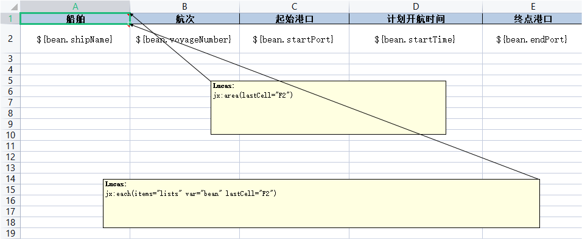
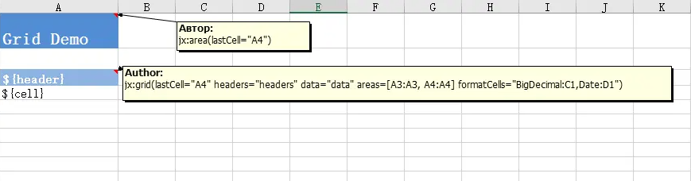

#### 前言
Jxls是一个简单的、轻量级的Excel导出库，它可以使用特定的标记在Excel模板文件中来自定义输出的格式和布局。
Java中成熟的Excel导出工具有poi、jxl，但他们都是使用Java代码的方式来导出Excel。当针对较为复杂的Excel时，例如：固定的样式、合并单元格、动态列等导出要求时，
使用传统的poi导出需要开发人员花费较大的精力去编写代码，编码效率低且不方便后期维护，但使用Jxls可以在很大程度上解决掉上述问题，其通过自定义模板可实现复杂的Excel导出。

#### 正文

##### 引入Maven依赖
```java
		<dependency>
			<groupId>org.jxls</groupId>
			<artifactId>jxls</artifactId>
			<version>2.4.6</version>
		</dependency>
		<dependency>
			<groupId>org.jxls</groupId>
			<artifactId>jxls-poi</artifactId>
			<version>1.0.15</version>
		</dependency>
		<dependency>
			<groupId>org.jxls</groupId>
			<artifactId>jxls-jexcel</artifactId>
			<version>1.0.7</version>
		</dependency>
		<dependency>
			<groupId>org.jxls</groupId>
			<artifactId>jxls-reader</artifactId>
			<version>2.0.3</version>
		</dependency>
```

##### Excel模板文件标记在Jxls中的作用分为三个部分
1. bean属性标记
2. XLS Area定义标记
3. XLS Command表示标记

##### bean属性标记
Jxls使用 Apache JEXL表达式语言来解析定义在Excel模板中的表达式。JEXL与JSTL相似，并对JSTL进行了扩展。
```java
${bean.attr1.attr2} // bean属性可以是无限深度
```

##### XLS Area定义标记
XLS Area 是JxlsPlus中的一个重要概念，它代表Excel模板中需要被解析的矩形区域，由A1到最后一个单元格表示，有利于加快解析的速度。XLS Area 使用Excel注释标注表示，它需要被定义在Excel模板的第一个单元格（A1）:
```java
jx:area(lastCell = "<AREA_LAST_CELL>") // 这个标记定义了Excel模板需要被解析的矩形区域为：A1到<AREA_LAST_CELL>
```
##### XLS Command表示标记
XLS Command 使用Excel注释标注表示，命令格式如下：
```java
jx:<command_name>(attr1='val1' attr2='val2' ... attrN='valN' lastCell=<last_cell> areas=["<command_area1>", "<command_area2", ... "<command_areaN>"])
```
##### Jxls常用指令说明
1. jx:each 循环
```java
jx:each(items="lists" var="bean" lastCell="F2")
```
参数说明：
| 参数名称 | 示例参数 | 是否必填  | 详细说明 |
| :-----: | :-----: | :-----: | :----- | 
| items | items="lists" | 必填 | 循环的集合对象 |
| var | var="bean" | 必填 | 循环中的变量名，指定之后区域内可以使用该名称访问属性 |
| lastCell | lastCell="F2" | 必填 | 指令对应的结束位置 | 
| direction | direction="right" | 非必填 | 输出的方向向下(DOWN)或向右(RIGHT)，默认为向下 |
| area | area="A8:F8","A13:F13" | 非必填 | 循环的区域，一次循环多行则需要填写，可以指定多个区域使用逗号分割 |
| select | select="employee.payment>2000" | 非必填 | 过滤条件，不需要通过${}来取值 |
| group | groupby="name" | 非必填| 根据对象中name属性进行分组，分组后的集合可通nameGroup.items来获取 |
| groupOrder | groupOrder="asc" | 非必填 | 指定分组排序(desc or asc) |
| multisheet | multisheet="sheets" | 非必填 | 循环的sheet名称集合，指定后会产生多个sheet，同时each的维度会变为sheet，不需要指定area |
| shiftMode | shiftMode="adjacent" | 非必填 | adjacent指定后会通过添加行的方式向指定的方向进行输出，inner则为通过添加单元格的方式向指定的方向进行输出 |

简单的示例图：  

  

2. jx:if 条件判断
```java
jx:if(condition="department.chief.name != 'Betsy'" lastCell="F4" areas = ["A3:F4"])
```
参数说明：
| 参数名称 | 示例参数 | 是否必填  | 详细说明 |
| :-----: | :-----: | :-----: | :-----: | 
| condition | department.chief.name != 'Betsy' | 必填 | 判断条件,字符串不需要通过${}来取值 |
| ifAreas | ifAreas = ["A3:F4"] | 非必填 | if指令影响的范围，当condition结果为true时则显示指定的范围 |
| elseAreas | elseAreas = ["A3:F4"] | 非必填 | if指令影响的范围，当condition结果为false时则显示指定的范围 |

1. jx:grid 输出表格
```java
jx:grid(lastCell="A4" headers="headers" data="datas" areas=[A3:A3,A4:A4] formatCells="BigDecimal:C1,Date:D1")
```
参数说明：
| 参数名称 | 示例参数 | 是否必填  | 详细说明 |
| :-----: | :-----: | :-----: | :----- | 
| headers | headers="headers" | 必填 | 循环的表头内容为List，表头和表体没有必然的关系 |
| data | data="datas" | 必填 | 循环的表体内容为List，当为bean对象时Java代码中需要指定读取的属性名称 |
| formatCells | formatCells="BigDecimal:C1,Date:D1" | 非必填 | 指定单元格格式化的方式 |

简单的示例图：  
  

4. jx:image 输出图片
```java
jx:image(src="bean2.imagebyte" lastCell="B9" imageType="PNG")
```
参数说明：
| 参数名称 | 示例参数 | 是否必填  | 详细说明 |
| :-----: | :-----: | :-----: | :-----: | 
| src | src="bean2.imagebyte" | 必填 | 输出的图片数据源byte[] |
| imageType | imageType="PNG" | 非必填 | 输出的图片格式可以不填 |

简单的示例图：  


