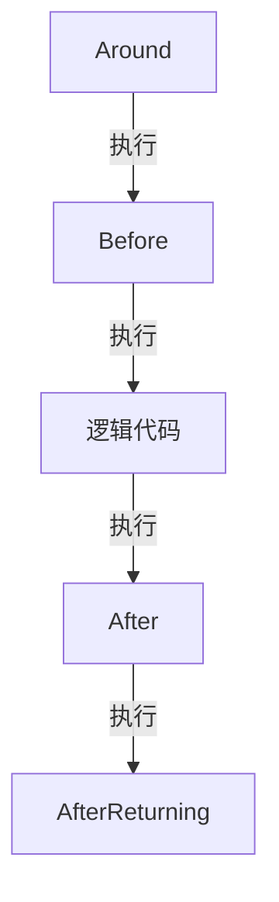

#### 前言
 AOP（Aspect Oriented Programming），通常称为面向切面编程。它利用一种称为"横切"的技术，剖解开封装的对象内部，并将那些影响了多个类的公共行为封装到一个可重用模块，并将其命名为"Aspect"，即切面。所谓"切面"，简单说就是那些与业务无关，却为业务模块所共同调用的逻辑或责任封装起来，便于减少系统的重复代码，降低模块之间的耦合度，并有利于未来的可操作性和可维护性。
 
#### 正文

##### AOP相关注解
* @Aspect：声明该类为一个注解类；
* @Pointcut：定义一个切点，后面跟随一个表达式，表达式可以定义为切某个注解，也可以切某个 package 下的方法；
* * *
* 围绕切点
* @Before：在切点之前，织入相关代码；
* @After： 在切点之后，织入相关代码;
* @Around: 环绕，可以在切入点前后织入代码，并且可以自由的控制何时执行切点；
* @AfterThrowing: 用来处理当织入的代码抛出异常后的逻辑处理;
* @AfterReturning: 在切点返回内容后，织入相关代码，一般用于对返回值做些加工处理的场景；

##### 执行顺序

##### AOP实现步骤
```Java
#引入依赖
        <dependency>
            <groupId>org.springframework.boot</groupId>
            <artifactId>spring-boot-starter-web</artifactId>
        </dependency>
        <dependency>
            <groupId>org.springframework.boot</groupId>
            <artifactId>spring-boot-starter-aop</artifactId>
        </dependency>
```


